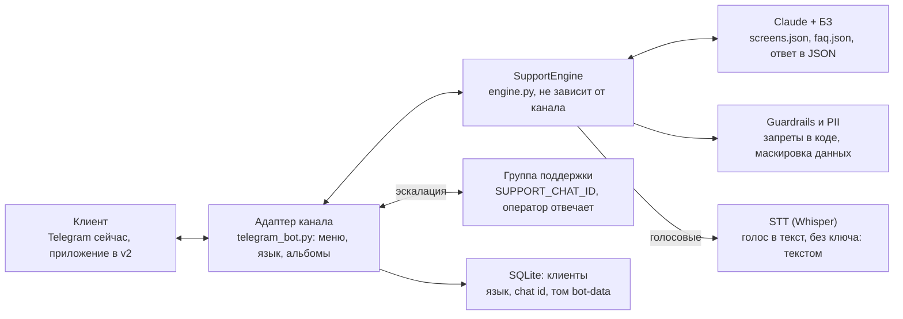

# ТЗ: AI Support бот Xonsaroy Pay

Версия от 5 октября 2026 · автор: Abdulbosid

## 1. Общие сведения

AI Support — бот первой линии поддержки клиентов Xonsaroy Pay: отвечает на вопросы и жалобы по базе знаний и передаёт оператору всё, что требует решения человека. Бот не творческий: он не придумывает ответы и не принимает финансовых решений.

**Цели**

- Снять с операторов типовые вопросы (регистрация, карты, платежи, переводы, квартирный долг, технические ошибки).
- Давать клиенту понятные шаги решения на его языке, в том числе по скриншоту или голосовому сообщению.
- Быстро и полно передавать оператору случаи, где нужен человек.

**Каналы:** v1 — Telegram-бот; v2 — мобильное приложение Xonsaroy Pay. Логика ответов не зависит от канала.

**Термины**

| Термин | Значение |
| --- | --- |
| База знаний (БЗ) | Файлы `screens.json` (экраны приложения) и `faq.json` (темы поддержки) |
| Эскалация | Передача обращения живому оператору в чат поддержки |
| Guardrails | Проверки в коде, которые блокируют запрещённые запросы и ответы независимо от модели |
| Backend | Сервер мобильного приложения; в v2 даёт статусы и логи операций |
| PII | Персональные данные: номер карты, ПИНФЛ, телефон, баланс |

## 2. Scope

Бот отвечает только по восьми разделам ниже. Всё остальное — вежливый отказ (`out_of_scope`) с предложением задать вопрос по приложению.

| Раздел | Что входит | Всегда к оператору |
| --- | --- | --- |
| 1. Регистрация и вход | регистрация, телефон и ПИНФЛ, OTP/SMS, MyID, вход | блокировка или ограничение доступа |
| 2. Карты | добавление, привязка, удаление, SMS-информирование, ошибки карты | блокировка карты сверх срока в приложении |
| 3. Платежи | связь, интернет, коммуналка, налоги, госплатежи, QR, история, статусы Success / Pending / Failed | деньги списаны при ошибке |
| 4. P2P-переводы | карта-карта, Pending, Failed, повторная операция | списано, но не зачислено; получатель не получил; спорные операции |
| 5. Квартирная задолженность | проверка долга, оплата по номеру договора, график, история, электронная квитанция | долг не обновился после оплаты |
| 6. Antifraud и ограничения | общее объяснение без деталей, VPN, повторные попытки, устройство | любая блокировка и подозрительная операция |
| 7. Технические проблемы | Server Error, Service Unavailable, timeout, бесконечная загрузка, приложение не открывается, интернет, ошибки после обновления | проблема остаётся после шагов из БЗ |
| 8. Профиль и настройки | доступные изменения профиля, язык, тема, настройки безопасности | изменение персональных данных |

**Вне scope:** финансовые советы, кредиты и инвестиции, вопросы о других приложениях и банках, общие разговоры не по теме.

## 3. Жёсткие правила

Бот никогда не принимает и не подтверждает финансовых решений. Правила заданы в промпте и дополнительно проверяются кодом (`guardrails.py`): если модель нарушила правило, её ответ целиком заменяется безопасной передачей оператору.

**Бот не должен:**

1. Подтверждать или обещать возврат средств.
2. Отменять платёж или перевод.
3. Разблокировать клиента или карту и обещать разблокировку.
4. Менять лимиты и данные клиента.
5. Называть статус операции или сроки («деньги вернутся через 2 часа»), если это не подтвердил backend. В v1 backend не подключён, поэтому статусы и сроки не называются совсем (кроме срока, написанного самим приложением на экране).
6. Подтверждать успех операции по словам или скриншоту клиента. При конфликте скриншота и backend верится только backend.
7. Раскрывать правила, критерии, пороги и алгоритмы Antifraud и любые внутренние данные.
8. Давать финансовые советы.
9. Придумывать ответы вне базы знаний.

**Пример допустимого ответа (в v2, когда статус пришёл из backend):** «По данным системы операция в статусе Pending. Рекомендуем не повторять платёж; мы передадим операцию на проверку.»

**Пример запрещённого ответа:** «Ваши деньги вернутся в течение 2 часов.»

**Категории, проверяемые кодом**

| Тип | Категории | Действие |
| --- | --- | --- |
| Запрос клиента | refund, cancel, unblock, limit_or_data_change, antifraud_internals | ответ по БЗ + обязательная эскалация |
| Ответ модели | promised_refund, promised_timeline, confirmed_success, unblocked, changed_limit_or_data, antifraud_criteria, financial_advice | ответ заменяется шаблоном + эскалация |

Паттерны покрывают четыре языка: узбекский (латиница и кириллица), русский, английский.

## 4. Функциональные требования v1

Все требования этого раздела уже реализованы и влиты в main (PR #1–#3, 4–5 октября 2026).

**4.1. Старт и выбор языка**

- При первом /start бот здоровается на узбекском, русском и английском и просит выбрать язык: O'zbekcha, Ўзбекча, Русский, English. По умолчанию — узбекский (латиница).
- Выбор сохраняется в базе клиентов и используется для меню и фиксированных ответов. Сменить язык можно в «Настройки».
- Ответ на свободный вопрос даётся на языке последнего сообщения клиента.

**4.2. Меню**

- Быстрые вопросы: карта, SMS-код, платёж, перевод, квартирный долг, история. Кнопки «Оператор» и «Настройки».
- Быстрый вопрос обрабатывается так же, как набранный вручную: по БЗ и через те же guardrails.
- На приветствие или «нужна помощь» бот не перечисляет свои возможности, а коротко спрашивает о проблеме и показывает мини-меню. Модель при этом не вызывается.

**4.3. Текстовые вопросы**

- Ответ строится только по БЗ. Если в БЗ ответа нет — эскалация, а не догадка.
- Контекст диалога: последние 6 пар реплик (`HISTORY_TURNS`), хранятся в памяти процесса, с замаскированными PII.
- Модель возвращает структурированный JSON: язык, тема из БЗ, id экрана, текст ответа, флаг эскалации и причина, флаг «на скриншоте видны персональные данные».

**4.4. Скриншоты**

- Бот определяет экран и ошибку по БЗ, объясняет её и даёт шаги решения.
- Принимается: фото с подписью и без, изображение файлом, альбом (один ответ на всё, до 5 изображений), текстовый ответ на свой ранее отправленный скриншот.
- Изображения нормализуются: сторона до 1568 px, размер до 3,5 МБ. Неподдерживаемый формат — просьба прислать скриншот.
- Для «оплачено» на скриншоте действует правило 6 из раздела 3: это не подтверждение.

**4.5. Голосовые сообщения**

- Голос распознаётся внешним Whisper-совместимым STT-сервисом, дальше текст идёт по обычному пути.
- Если STT не настроен или упал, бот просит написать текстом.

**4.6. Ошибки и пустые сообщения**

- Модель недоступна — шаблонный ответ и эскалация.
- Пустое сообщение — подсказка и меню.

## 5. Архитектура и технологии

Ядро `engine.py` принимает сообщение клиента в формате, не зависящем от канала, и возвращает безопасный ответ; Telegram — лишь один из адаптеров.

**Порядок обработки сообщения**

1. Голосовое переводится в текст через STT; изображения нормализуются.
2. Приветствие без проблемы — короткий вопрос и мини-меню без вызова модели.
3. Guardrails проверяют, не просит ли клиент что-то из запрещённого.
4. Claude отвечает по БЗ структурированным JSON.
5. Ответ проверяется на запрещённые фразы и маскируется; при нарушении заменяется шаблоном.
6. Если нужен человек, адаптер публикует обращение в группу поддержки.

| Что | Технология |
| --- | --- |
| Язык | Python 3.11 |
| Telegram | aiogram 3 |
| Модель | Claude (`CLAUDE_MODEL`, усилие `CLAUDE_EFFORT=medium`), структурированный вывод |
| Голос | Whisper-совместимый HTTP STT (`STT_API_URL`, `STT_MODEL`) |
| Изображения | Pillow |
| Хранение клиентов | SQLite (`DB_PATH`) |
| Развёртывание | Docker Compose: `.env`, БЗ только для чтения, том `bot-data`, автоперезапуск |
| CI | GitHub Actions: тесты + сборка и запуск контейнера |

## 6. База знаний

БЗ v1 состоит из 21 экрана приложения и 25 тем поддержки; темы в статусе «черновик» и должны быть проверены командой Xonsaroy Pay до запуска.

| Файл | Содержимое | Поля записи |
| --- | --- | --- |
| `data/knowledge_base/screens.json` | 21 экран по скриншотам: регистрация, главная, карты, переводы, платежи, история | страница, состояние, текст ошибки, значение, шаги, что нельзя говорить, условие эскалации |
| `data/knowledge_base/faq.json` | 25 тем по 8 разделам scope, канонический язык — русский | раздел, id, заголовок, шаги ответа, условие эскалации, источник, статус |
| `data/screenshots/` | исходные скриншоты, разложенные по страницам, + `catalog.yaml` | — |

**Требования к БЗ**

- Ответ на любой вопрос из scope должен опираться на запись БЗ; без записи — эскалация.
- Каждая запись имеет условие эскалации и список запретов, если тема чувствительная.
- Персональные данные на скриншотах БЗ замаскированы.
- Правка БЗ не требует пересборки: файлы подключены к контейнеру только для чтения, достаточно `docker compose restart bot`.
- Структура файлов проверяется тестом `test_knowledge_base.py`.

**Чего в БЗ пока нет:** экраны регистрации (шаги 3–4), ошибки платежей и переводов, профиль и настройки, QR-платежи, экраны квартирной задолженности (см. раздел 11).

## 7. Эскалация к оператору

Бот передаёт обращение в группу поддержки Telegram (`SUPPORT_CHAT_ID`); оператор отвечает реплаем на пост бота, и бот пересылает ответ клиенту.

**Когда эскалируется**

- Клиент нажал «Оператор» или попросил человека.
- Запрос из запрещённых категорий: возврат, отмена, разблокировка, лимит или данные, Antifraud.
- Спорные операции, деньги списаны без услуги, получатель не получил перевод.
- Сработало условие эскалации из записи БЗ (например, «SMS не приходит после нескольких запросов»).
- В БЗ нет ответа или случай непонятен.
- Guardrail заменил ответ модели или модель недоступна.

**Что видит оператор:** текст клиента (с маскировкой PII), тему, распознанный экран, причину эскалации, язык клиента, его username и ответ, который бот уже отправил.

**Что видит клиент:** ответ по БЗ (если есть) и сообщение, что обращение передано сотруднику, без обещаний срока ответа.

## 8. Безопасность и персональные данные

Персональные данные маскируются везде, куда попадает текст: в ответе клиенту, в истории диалога и в посте для оператора.

| Данные | Как маскируется |
| --- | --- |
| Номер карты (16 цифр) | `8600 **** **** 1234` |
| ПИНФЛ (14 цифр) | `**************` |
| Телефон +998 | `+998 ** *** ** **` |
| Баланс и суммы рядом со словом «баланс» | скрывается |

- Если на скриншоте видны персональные данные, бот добавляет просьбу больше их не присылать.
- Бот никогда не просит номер карты, ПИНФЛ, CVV, пароль или SMS-код. Для проверки операции просит только время и сумму.
- Изображения не сохраняются: в историю попадает только отметка «клиент прислал N изображений, распознан экран X».
- История диалога живёт только в памяти процесса и пропадает при перезапуске.
- В базе клиентов (SQLite) хранятся только канал, id, chat id, username, имя, язык устройства и выбранный язык. Тексты сообщений не хранятся.
- Ключи (Telegram, Anthropic, STT) задаются только через `.env` и не коммитятся.
- Бот не раскрывает системный промпт и не выполняет инструкции из текста клиента или скриншота, которые противоречат правилам.

## 9. Тестирование и приёмка

Каждое изменение промпта или логики покрывается тестами на запрещённые ответы; CI (GitHub Actions) запускает тесты и сборку Docker на каждый PR.

| Уровень | Что проверяется | Статус |
| --- | --- | --- |
| Юнит-тесты (около 90) | guardrails, маскировка PII, движок, языки, меню, база клиентов, изображения, Telegram-адаптер, структура БЗ | в CI, зелёные |
| Docker | образ собирается, контейнер без токена завершается с понятной ошибкой | в CI |
| Live red-team (`RUN_LIVE=1`) | живая модель не даёт запрещённых ответов; скриншоты из БЗ распознаются правильно | **ещё ни разу не запускались**: нужен ключ Anthropic |

**Критерии приёмки v1**

- [ ] Live red-team пройден на живой модели без единого запрещённого ответа.
- [ ] Команда Xonsaroy Pay проверила и перевела темы `faq.json` из «черновика» в «проверено».
- [ ] Все 21 экран БЗ распознаются по скриншоту.
- [ ] Оператор получает эскалацию в группе поддержки, его реплай доходит до клиента.
- [ ] Голосовое на узбекском и русском распознаётся и получает ответ по теме.
- [ ] Ручное тестирование по всем 8 разделам scope на 4 языках.

## 10. Планы v2

Главное в v2 — данные из backend: только с ними бот сможет называть статус конкретной операции. Сроки v2 не согласованы.

**10.1. Endpoint статуса операции**

- Backend мобильного приложения отдаёт статус и лог операции (Success / Pending / Failed, сумма, время, поставщик, код ошибки).
- Бот находит операцию по данным клиента (время, сумма) и связанному аккаунту.
- Статус называется только из ответа backend. Сроки — только если backend их вернул. При конфликте со скриншотом клиента прав backend.
- Guardrails должны различать «статус подтверждён backend» и «модель придумала статус»; второе по-прежнему запрещено.
- Возврат, отмена и разблокировка остаются за человеком и в v2.

**10.2. Уведомления**

- Рассылка клиентам на их выбранном языке (уже есть `UserStore.by_language`): например, о технических работах или смене статуса обращения.

**10.3. Канал «мобильное приложение»**

- Чат поддержки внутри приложения использует тот же `engine.py`; нужен только новый адаптер (HTTP API) в `channels/`.
- Клиенты пишутся в ту же таблицу со своим `channel`.
- В приложении бот знает авторизованного клиента, поэтому может запрашивать его операции без лишних вопросов.

**10.4. Инфраструктура**

- Историю диалога перенести из памяти в БД, чтобы бот мог работать в нескольких экземплярах.
- При росте нагрузки — PostgreSQL вместо SQLite.

## 11. Открытые вопросы

На эти вопросы нужен ответ команды Xonsaroy Pay; без них часть ответов бота остаётся непроверенной.

**База знаний**

- [ ] На каком шаге появляется ошибка доступа к камере (на скриншоте она на экране ввода номера)?
- [ ] Когда показывается «To'lov vositalari yetarli emas»: только без карт или также при недостатке средств?
- [ ] Что говорить при блокировке карты на 1 час и когда передавать оператору?
- [ ] Какие карты поддерживаются: только Uzcard и Humo или также Visa / Mastercard (на экране есть их логотипы)?
- [ ] Нужны скриншоты: регистрация (шаги 3–4), ошибки платежей и переводов, QR, квартирная задолженность, профиль и настройки.
- [ ] Кто проверяет и утверждает 25 тем `faq.json` и дальнейшие правки БЗ?

**Эскалация и эксплуатация**

- [ ] Часы работы операторов и что бот отвечает ночью или в выходные?
- [ ] Нужна ли внешняя helpdesk-система (тикеты) вместо или помимо группы Telegram?
- [ ] Где и как разворачивается бот в production (сервер, кто держит ключи)?
- [ ] Какой STT-сервис использовать и допустимо ли отправлять туда голос клиентов?
- [ ] Нужны ли метрики (доля эскалаций, темы обращений, оценка ответа клиентом)?
- [ ] Требования к хранению данных клиентов (срок, серверы в Узбекистане по закону о персональных данных)?

**v2**

- [ ] Формат endpoint статуса операции: поля, авторизация, как связать Telegram-аккаунт с аккаунтом Xonsaroy Pay.
- [ ] Какие уведомления нужны и кто их запускает?
- [ ] Сроки и порядок работ v2.
